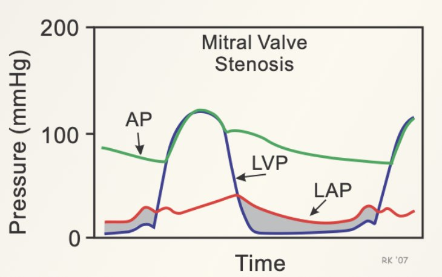

# HANDOFF — Cardio Summative Objective Review

> For any Claude session, on any account, picking this up. **Read this whole file before touching the page.**
> Last updated: **2026-10-09**, after Part H (§28–§36) and §37 were written and checked in the browser. **All Parts are done.**
> Update §8 (status) and §9 (log) every time a section lands, before you start the next one.

---

## 1. What this is

| Thing | Path (from `~/Documents/GitHub/Second-Year/`) |
|---|---|
| **The page (source of truth)** | `OMK/Cardio/summative/OMK_2A_Cardio_Summative_Objective_Review.html` |
| Section outline + objective map | `OMK/Cardio/summative/OMK_2A_Cardio_Summative_Objective_Review_OUTLINE.md` |
| Build kit (fragments + inject script) | `OMK/Cardio/summative/_build/` |
| Figures used by the page | `OMK/Cardio/summative/assets/` |
| The model it copies | `OMK/Heme/summative/OMK_2A_Heme_Summative_3_Objective_Review.html` |
| Notes style guide | `Quiz, anki, notes instruction /OMK_2_notes.md` (§3 has the Cardio theme) |
| Study guide (last year's) | `~/Downloads/Cardio Study Guide.docx` |
| Lecture notes (the content source) | `OMK/Cardio/Week 13/Notes/`, `Week 14/notes/`, `Week 15/notes/`, `Week 17/notes/` |
| UWorld questions mapped to lectures | `OMK/Cardio/UWorld_Cardio_by_Lecture.txt` (planning only) |

The page is an **objective-by-objective review for the OMK 2A Cardiology summative exam**: a coverage map of all 101 study-guide objective lines, a master high-yield checklist, 37 numbered sections in Parts A–H, a pending list, a glossary, and a printable high-yield one-pager. Same chrome and study tools as the Heme review (sidebar with sub-links, mark reviewed / confidence, recall mode, highlighter, table quiz, lightbox, themes, text size).

The owner is **Jeeval**, a second-year osteopathic medical student at UNE COM. Use they/them if you need a pronoun.

---

## 2. Jeeval's standing preferences (non-negotiable — another account will not have these in memory)

**Look**
- **Cardio theme is the default.** Blue hero and sidebar, arterial-red accent, clinical-blue links, pink `--hero-accent`, ECG trace in the hero (from `OMK_2_notes.md` §3). Never fall back to the Heme maroon palette.
- Big serif body text, Playfair headings, dark hero, numbered dark sidebar, dark-header tables with zebra rows, coloured callouts, dark "EXAM Q" cards. Already in place; don't restyle.
- **A picture beside each disease** in comparison tables: a `td.pic-cell` thumbnail (see §6). Hand-pick every image and look at it before captioning. Automatic image matching picks wrong images.
- **No UWorld images. Ever.** Lecture slides, AMBOSS, Robbins, First Aid, CV Pathophysiology figures are fine. UWorld *text* can be cited as a board add-on.

**Words**
- **Spell out abbreviations.** Each section starts with an `abbr-strip` listing every short form it uses; expand on first use *per section* (sections are read out of order). Gloss opaque words too. The glossary is the backstop.
- **Warm tutor voice, full sentences, bullets over paragraphs.** One idea per bullet. No walls of bold or highlight.
- **No arrow chains (→ ↑ ↓) in prose.** Arrows are fine inside compact tables and the one-pager only.
- **Neutral labels.** No "Where you'll slip"-style headings; use "Common pitfalls" or describe the content.
- **No UWorld question counts or IDs on the page.**
- Write exam questions as clean question → answer. Vignettes are welcome.

**Colour meaning** (CSS lives in `_build/content.css`)
| Markup | Meaning |
|---|---|
| `<strong class="hot">` | Red bold: the lecturer said it will be tested, or repeated it |
| `<strong>` | Blue bold: key fact or mechanism |
| `<span class="num">` | Yellow: a number to memorise |
| `<span class="src-tag">Board add-on</span>` | Not from the lecture: UWorld/AMBOSS library text or First Aid |
| `callout-review` box (red outline) | A lecturer quote or emphasis ("🎙️ From the recording" / "🎯 …") |
| `callout-warning` box | A recording slip, or a disagreement between sources |

**Sources** (this is a course exam, so the hierarchy differs from Board Study chapters)
1. **Lecture notes lead** — the Week 13–17 study-notes HTML files, which already merge slides + recording transcripts and flag lecturer emphasis as red bold. Carry that red through.
2. **Board add-ons** — UWorld and AMBOSS library articles (`~/Board Study/build/text/uwlib.json`, `amblib.json`, lists of `{i, title, path, text}`), First Aid 2026 (`~/Board Study/build/text/fa2026.json`, list of `{p, t}`; PDF page = book page + 22), Pathoma (`pathoma.json`). Tag every add-on.
3. Where a recording contradicts the slide or textbook, say so in a `callout-warning` and give the board answer.

**Process**
- Jeeval reviews in pieces. Deliver **one Part at a time**, show it, and list the judgement calls they may want to override.
- **2026-10-09 instruction:** "after C, just keep going until you run out of credit" — so Parts D–H are being written back to back without waiting for review. Keep updating §8/§9 after each Part.
- Keep this handoff current as each section lands. Conversations get compacted.
- **The study guide is last year's.** If a new guide arrives, diff it against the 101 lines before writing more.

---

## 3. How the page is built (read before editing)

The page is the source of truth, but **section bodies are regenerated from fragments**. Running `inject.py` replaces each injected section's inside from its fragment, so a direct edit inside an injected section will be lost. Always edit the fragment, then re-run.

```
OMK/Cardio/summative/_build/
  inject.py            ← run this; safe to re-run (idempotent)
  content.css          ← extra CSS (emphasis layer, picture cells); injected between /*==CONTENT CSS==*/ markers
  sections/<id>.html   ← everything inside <section class="section" id="<id>"> … </section>
  hy/<id>.html         ← that section's block in the one-pager; must carry data-sec="<id>"
  checklist.html       ← Master High-Yield Checklist body (cumulative — append cards)
  glossary.html        ← Glossary body (cumulative — append groups/terms)
  pending.html         ← Objectives Still Pending body
  status.json          ← objective statuses (1–101 → full | part | none) + sidebar label overrides
```

```bash
cd ~/Documents/GitHub/Second-Year/OMK/Cardio/summative && python3 _build/inject.py
```

The script also recomputes every counter: the coverage-map row badges and filter counts, the hero tiles (fully/partly covered, exam questions) and the pending badge.

**Section ids** (sidebar order): `s1-cardiac-cycle s2-heart-sounds s3-murmurs s4-exercise s5-pharm-basics s6-ecg-basics s7-ecg-patterns s8-arrhythmias s9-afib s10-antiarrhythmics s11-atherosclerosis s12-ihd-acs s13-biomarkers s14-mi-path s15-mi-complications s16-ihd-pharm s17-hf s18-hf-pharm s19-cardiomyopathy s20-tumors s21-ie s22-ie-dx-rx s23-myo-peri s24-valves s25-avr s26-chd s27-coarct-newborn s28-htn s29-htn-pharm s30-lipids s31-lipid-pharm s32-aneurysm-dissection s33-ctd s34-vasculitis s35-pad s36-mesenteric s37-women`. Don't rename ids; change the visible title in the fragment and the sidebar label via `status.json → toc_labels`.

**Objective numbers.** The coverage map numbers the study guide's lines **1–101 in printed order**. Section badges read `<span class="lo-badge">LO 23</span>`; the hover tooltip and click-to-jump work only when the badge text contains the bare 1–101 number. Topic.bullet ↔ number table: bottom of `…_OUTLINE.md` (the **#** column). Quick ranges: topic 1 = 1–9, 2 = 10–15, 3 = 16–20, 4 = 21–28, 5 = 29–48, 6 = 49–50, 7 = 51–60, 8 = 61–62, 9 = 63, 10 = 64–72, 11 = 73–77, 12 = 78–82, 13 = 83–85, 14 = 86–90, 15 = 91–101 (repeats).

**Do not** regenerate the shell from scratch: the original shell builder lived in a scratchpad and is gone, and rebuilding would wipe the content.

---

## 4. Recipe for one section

1. **Read the sources** for that section (§7 table). Extract a note file to text so you can read it whole:
   ```bash
   python3 - "$F" <<'EOF'
   import re,sys,html; h=re.sub(r'data:[^"\')]+','DATA',open(sys.argv[1],encoding='utf-8').read())
   m=re.search(r'<main.*?</main>',h,re.S); b=m.group(0) if m else h   # some notes have no <main>
   b=re.sub(r'<style.*?</style>|<script.*?</script>|<svg.*?</svg>','',b,flags=re.S)
   b=re.sub(r']*src="([^"]+)"[^>]*alt="([^"]*)"[^>]*>',r'\n[IMG \1 | \2]\n',b)
   b=re.sub(r'<h([1-4])[^>]*>',lambda m:'\n'+'#'*int(m.group(1))+' ',b); b=re.sub(r'<li[^>]*>','\n- ',b)
   b=re.sub(r'<(strong|b)[^>]*>','**',b); b=re.sub(r'</(strong|b)>','**',b); b=re.sub(r'<[^>]+>',' ',b)
   print(re.sub(r'\n\s*\n+','\n',re.sub(r'[ \t]+',' ',html.unescape(b))))
   EOF
   ```
   Lecture notes mark recording emphasis with `strong class="hot"` (shown as `**…**` after extraction); check the source HTML when you need to know which bold was red.
2. **Pull add-ons** from the libraries when the lecture is thin (example in §9: the murmur maneuvers came from First Aid p. 294).
3. **Copy figures** into `summative/assets/` (names are already unique by prefix: `cc-` cardiac cycle, `p-` physiology, `er-` exercise rehab, `b-` basic science, `c-` cardiac pathology, and so on). Get sizes with `sips -g pixelWidth -g pixelHeight file.jpg` and put them in `width`/`height`. **Look at each image** (Read tool) before captioning, and check its source isn't UWorld.
4. **Write the fragment** `_build/sections/<id>.html`, using the existing Part A fragments as the template (§6 has snippets). Structure: badge-row (LO badges + `lo-badge src`), section-label, h2 title, lede, abbr-strip, then `h3` subsections (add `<span class="hy-flag">★ HY</span>` to high-yield ones), then 4–7 `exam-q` cards at the end.
5. **Write the one-pager block** `_build/hy/<id>.html` (`<div class="hy-block" data-sec="<id>"><h4>…</h4><ul>…</ul></div>`).
6. **Mark objectives** in `_build/status.json` (`full` only when the objective is worked in full; otherwise `part`, and say what's missing in `pending.html`).
7. **Append** checklist cards (number them on from the last one), glossary terms, and pending notes.
8. `python3 _build/inject.py`, then **verify in a browser** (§5).
9. **Update §8 and §9 of this file.**

---

## 5. Verifying (and two traps)

- **The page is behind the Study Hub login gate** and locked to Jeeval until `SUMMATIVE_RELEASE_AT` (set to 2099 in the `<head>` script). Change that date only when Jeeval asks. To preview it, unlock in the browser console. This holds the attribute open, because a timer re-locks the page every second:
  ```js
  var de=document.documentElement;
  new MutationObserver(()=>{if(de.getAttribute('data-note-auth')!=='unlocked')de.setAttribute('data-note-auth','unlocked')}).observe(de,{attributes:true,attributeFilter:['data-note-auth']});
  de.setAttribute('data-note-auth','unlocked');
  ```
- **Opening the file directly (`file://`) in the Claude desktop browser pane shows a frozen copy with no images.** Serve the folder instead: `~/.claude/launch.json` has a config named **`cardio-summative-static`** (python http.server on port 8805, folder `OMK/Cardio/summative`). Start it with the preview tool, then open `http://localhost:8805/OMK_2A_Cardio_Summative_Objective_Review.html`.
- Checks run for Part A: no console errors; every `main img` has `naturalWidth > 0`; coverage statuses match `status.json`; one-pager blocks present; no horizontal page scroll at 375 px (`scrollWidth == clientWidth`); the injector is idempotent (same md5 on a second run).

---

## 6. Component snippets

```html
<!-- figure(s): n1 = one wide, n2 = two, n3 = three, nx = many small -->
<div class="figs"><div class="fig-grid n2">
  <figure class="fig-item">
    
    <figcaption class="fig-cap">What to notice. Source: Qazi lecture</figcaption>
  </figure>
</div></div>

<!-- picture beside each disease, inside a comparison table -->
<td class="pic-cell"><figure class="fig-item"></figure></td>

<!-- quiz-able table: data-quiz="1" adds the "Quiz this table" bar -->
<div class="tbl-scroll"><table data-quiz="1"><thead><tr><th>…</th></tr></thead><tbody>…</tbody></table></div>

<!-- callouts: callout-key (gold) · callout-concept (blue) · callout-clinical (green) · callout-warning (red) · callout-hook (dashed gold) · callout-review (red outline; add <p class="rv-said">quote</p>) -->
<div class="callout callout-clinical"><div class="callout-title">🩺 Title</div><p>…</p></div>

<!-- two/three-card comparison -->
<div class="compare-grid"><div class="compare-card"><span class="card-emoji">🧱</span><h4>Title</h4><ul><li>…</li></ul></div></div>

<!-- fact tiles -->
<div class="fact-grid"><div class="fact-card"><h4>Title</h4><p class="generic">small label</p><p>Body</p></div></div>

<!-- numbered steps / arrow bullets -->
<ol class="step-list"><li><strong>Step title.</strong> Detail.</li></ol>
<ul class="notes-list"><li>…</li></ul>

<!-- up/down arrows inside tables only -->
<span class="up">↑</span> <span class="dn">↓</span>

<!-- exam question -->
<div class="exam-q">
  <p><strong>Q:</strong> …</p>
  <button class="reveal-btn" onclick="this.closest('.exam-q').classList.add('revealed')">Reveal answer</button>
  <div class="answer"><div class="label">Answer</div><p>…</p></div>
</div>
```

Glossary groups: `<h3>Group</h3><div class="gloss"><dl><dt>TERM — expansion</dt><dd>Meaning.</dd></dl></div>`.
Checklist card: `<div class="hallmark-card"><span class="hallmark-num">18</span><h4>Rule</h4><p>…</p></div>`.

---

## 7. Source map for Parts B–H (what feeds each section, and overlaps already handled)

| § | Section | Lecture note files (folder) | Notes |
|---|---|---|---|
| 6 | Reading the ECG | `ECG_Basics_Study_Notes.html` (W13) | Action potentials and the conduction path are already in **§5** — link to it, don't repeat |
| 7 | ECG patterns of disease | `ECG_Basics` (W13), `ECG_II_Clinical_Arrhythmias` (W14) | |
| 8 | Arrhythmias & heart block | `ECG_II_Clinical_Arrhythmias` (W14) | 11 objectives point here |
| 9 | Atrial fibrillation | `ECG_II` (W14), `Antiarrhythmic_Pharmacology` (W14) | |
| 10 | Antiarrhythmic drugs | `Antiarrhythmic_Pharmacology` (W14) | Ion currents are in §5 |
| 11 | Arterio- vs atherosclerosis | `Vascular_Pathology` (W13) | Scully's foam-cell/plaque slides are in `CV_Pharm_Basic_Sciences_Review` (W13) topic 5 — not yet used anywhere |
| 12 | Stable angina vs ACS | `Application_Session_1_Chest_Pain_HTN` (W15), `Cardiac_Pathology` (W13) | |
| 13 | Troponin & BNP | `Application_Session_1`, `Application_Session_2_Heart_Failure_PAD` (W15) | |
| 14 | MI histology timeline | `Cardiac_Pathology` (W13) — "infarct clock" | |
| 15 | Post-MI complications | `Cardiac_Pathology` (W13), `Application_Session_1` (W15) | Papillary muscle rupture/acute MR is touched on in §3 |
| 16 | Antianginal drugs | `Ischemic_Heart_Disease_Pharmacology` (W14) | |
| 17 | HFrEF vs HFpEF | `Application_Session_2` (W15), `Cardiac_Pathology` (W13), `Cardiac_Physiology_Review` (W14) topic 6 | PV-loop and Guyton views of failure are in §1 and §5 — link, keep §17 clinical |
| 18 | Heart failure drugs | `Heart_Failure_Pharmacology` (W14) | |
| 19 | Cardiomyopathies | `Cardiac_Pathology` (W13) | HCM murmur and maneuvers are in §3 |
| 20 | Heart tumors | `Cardiac_Pathology` (W13), `Cardiothoracic_Surgery` (W17) | |
| 21–23 | Endocarditis, myocarditis, pericarditis | `Endocarditis_Myocarditis_Pericarditis` (W13), `Cardiac_Pathology` (W13) topic 7 | |
| 24 | Valvular heart disease | `Cardiac_Pathology` (W13) topic on valves; `Cardiac_Cycle_Valve_Hemodynamics` (W15) | **§3 already covers hemodynamics, murmurs, signs, causes and rheumatic heart disease.** Make §24 the pathology + management view: calcific vs bicuspid pathology, myxomatous histology, MS treatment (beta-blockers, diuretics, balloon commissurotomy), primary MR repair-over-replace, right-sided valves (UWorld articles 1164–1167). Link back to §3 |
| 25 | Aortic valve replacement | `Cardiothoracic_Surgery` (W17); `Cardiac_Cycle_Valve_Hemodynamics` (W15) aortic-stenosis treatment notes (TAVR first-line, transfemoral; surgery = sternotomy recovery) | |
| 26–27 | Congenital heart disease | `Pediatric_Cardiology` (W14), `Cardiac_Pathology` (W13) shunts | |
| 28 | Hypertension | `Application_Session_1` (W15), `Hypertension_Pharmacology` (W13) | |
| 29 | Hypertension drugs | `Hypertension_Pharmacology` (W13) | ACE/kininase II is mentioned in §5 |
| 30–31 | Dyslipidemias and lipid drugs | `Dyslipidemia_Pharmacology` (W14) | Diet patterns (Mediterranean, DASH, sodium) are in **§4** — link for objective 69 rather than repeat |
| 32–33 | Aneurysm, dissection, connective tissue | `Vascular_Pathology` (W13), `Vascular_Surgery` (W15), `Cardiothoracic_Surgery` (W17) | |
| 34 | Vasculitis | `Vascular_Pathology` (W13) | |
| 35–36 | PAD, mesenteric ischemia | `Vascular_Surgery` (W15), `Application_Session_2` (W15) | PAD as a class I rehab indication is in §4 |
| 37 | CV health in women | `Cardiovascular_Health_in_Women` (W15) | No study-guide objective; keep it short |

Each week's `assets/` folder holds the figures those notes use. `Week 14/notes/assets/NOTES_BUILD_METHOD.md` and `Week 15/notes/assets/NOTES_BUILD_METHOD.md` record how those notes were built and which AMBOSS article indices they used.

---

## 8. Status

| Part | Sections | State | Objectives marked full |
|---|---|---|---|
| **A — The normal heart** | §1–§5 | **Written, injected, checked in the browser (2026-10-07)** | 1–9, 72 |
| **B — ECG & arrhythmias** | §6–§10 | **Written, injected, checked in the browser (2026-10-09)** | 29–48, 94 |
| **C — Atherosclerosis & ischemia** | §11–§16 | **Written, injected, checked in the browser (2026-10-09)** | 16–20, 23, 24, 83–85, 100 |
| **D — Heart failure & myocardium** | §17–§20 | **Written, injected, checked in the browser (2026-10-09)** | 21, 22, 25–28, 61–63, 91–93 |
| **E — Infection & inflammation** | §21–§23 | **Written, injected, checked in the browser (2026-10-09)** | 51–60, 95 |
| **F — Valves & surgery** | §24–§25 | **Written, injected, checked in the browser (2026-10-09)** | 49, 50, 98, 99 (5–6 already full) |
| **G — Congenital** | §26–§27 | **Written, injected, checked in the browser (2026-10-09)** | 10–14; **15 partial** (no predictive-value figure in the lecture) |
| **H — Vessels** | §28–§36 | **Written, injected, checked in the browser (2026-10-09)** | 64–71, 73–82, 86–90, 96, 97, 101 |
| Supporting | §37 | **Written (2026-10-09)** — short; no objective maps to it | — |

Totals now: **100 full + 1 partial (objective 15) / 101 objectives**, 235 exam questions, 81 checklist cards, 11 glossary groups. No `shell-todo` and no "To come" blocks remain.

**Next up: nothing is left to write.** When this year's study guide arrives, diff its objectives against the coverage map and add or retire sections. Objective 15 stays partial until a source gives the echo predictive value. Unused assets left in `assets/` from earlier sessions (`aa-*`, `k-*`, `p-*`, `r-a-vt-criteria`, `b-raas`, `b-ace-bradykinin`, `er-prevention-pyramid`) were not deleted; `b-raas` may be a UWorld figure, so check it before using it.

**New tool:** `_build/imgsize.py <fragments>` fills `width`/`height` on every `` from the real file, so fragments can be written without sizes. Run it before `inject.py`.

## 9. Log

**2026-10-09 — Whole-page audit (after all Parts were written)**
- Abbreviations: every section's strip was checked against the abbreviations its text uses; 33 strips gained entries (e.g. QRS/PR/ST in the ECG sections, IV, GI, ICU, NSAID, SGLT2). Mnemonics (WiLLiaM, QUEEN PROofreads DISsertations, FROM JANE, SAD, BS), trial names and gene symbols were left out on purpose. `AV` means arteriovenous in §28 and §35. The checker is ``cd _build/sections && python3 ../abbrcheck.py --dry` (without `--dry` it appends the missing entries).
- No arrow chains in prose anywhere. No UWorld question counts or IDs; UWorld is only named where sources disagree.
- Pictures: §2 (heart sounds) had none, so it now has two AMBOSS figures (`pc-a-fixed-split`, `pc-a-phono-systolic`). The §32 aneurysm-location table has a Picture column (`vs-cta-aneurysm`, `vs-splenic-aneurysm`, `vs-popliteal-aneurysm`); the standalone popliteal figure moved into it. No non-UWorld pictures exist for the other tumour, aneurysm or pericarditis rows.
- Walls of text: the 11 paragraphs over 85 words (§3, §6, §7, §8, §9, §10, §23) became bullet lists, with the content unchanged.
- Numbers: every figure in §1–§37 was searched for in the lecture notes. All are sourced except the textbook normal EDV and EF in §1. Fixed: PAD smoking risk is 2–3× (2–4× on one quiz slide). Confirmed from slide images: the dental bacteremia rates (§21) and DCM 20–50% genetic (§19).
- Checks: idempotent, 342 `main img` all load, no console errors.

**2026-10-09 — Part H and §37**
- §28 Hypertension, §29 HTN pharmacology, §30 dyslipidemias, §31 lipid pharmacology, §32 aneurysm and dissection, §33 connective-tissue aortopathies, §34 vasculitis: written and injected earlier in the day (see the status row).
- §35 PAD (LO 73–76): vascular vs neurogenic claudication table (shopping cart, uphill), the rest of the differential (statin nocebo/SAMSON), the clinical spectrum (claudication, CLTI, ALI), the exam (dependent rubor vs cellulitis, blue toe), the ABI table with the worked 54/140 example, CTA-not-angiogram trap, aortoiliac disease with Leriche and the bypass-patency table, infrainguinal and tibial disease, acute limb ischemia (six P's, heparin first, lysis vs Fogarty, thrombolysis contraindications, reperfusion compartment syndrome, amputation energy cost), and management (SET dose, smoking, statin, SAPT or aspirin + rivaroxaban, cilostazol HF warning, revascularisation indications), with natural history and polyvascular risk. Two slips flagged: the backwards rest-relief row on one App Session 2 table, and the recording's "anticoagulation first" for claudication. 7 questions.
- §36 Mesenteric ischemia (LO 77): anatomy and collaterals, acute types table (embolus, thrombosis, NOMI, venous, infarction) plus chronic, CTA and "when in doubt, operate". 3 questions.
- §37 Women's CV health (no objective, kept short): myths and numbers, female-specific presentations (board add-on), menarche, pregnancy complications, menopause and the MHT timing hypothesis and traffic light. 3 questions.
- Figures: `vs-` (Ciraulo), `as2-` (Segal PAD case; `as2-leriche-ct` cropped to drop its caption), `wh-` (Qazi). No UWorld images. `vs-splenic-aneurysm` copy removed as unused.
- Wrap-up: checklist cards 68–81 (intro now says Parts A–H), glossary group "Vessels", pending Part H "things to know" card and an "All Parts" recheck card replacing "Still to write"; pending intro rewritten. `inject.py` pending badge now reads "1 objective partly covered · none unwritten" once nothing is unwritten.
- Checks: injector idempotent (same md5 twice), all 338 `main img` load, no console errors, no `shell-todo`, page width 375 = scrollWidth after reloading at 375 px, nothing in §35–§37 overflows outside table scrollers.

**2026-10-09 — Part G**
- §26 CHD: fetal circulation and first breath, sorting grid, **picture-column acyanotic table** (VSD/ASD/PDA/coarct, peds slides), gross specimens, ASD types and AVSD, Eisenmenger, 5 T's, **picture-column cyanotic table** (TOF, TGA, HLHS + board rows for truncus, tricuspid atresia, TAPVR, Ebstein), TOF depth with tet-spell and BT-shunt figures, cyanotic features + CXR-sign table, syndrome → lesion → gene table (Gardner genetics + First Aid associations), presentations and comorbidities. 7 questions.
- §27 Coarct/newborn: the 6-hour-old case, exam-findings table, coarct facts and treatment, figures, older-child box, incidence (peds chart + Gardner table) with a disagreement callout, the newborn murmur (lecture), predictive value (**approximate literature range, flagged — objective 15 left partial**), CCHD pulse-ox screening (UWorld), a triage table. 6 questions.
- Figures: more `pc-` (peds) and `c-` (Gardner). Checks: idempotent, no console errors, 270 images load, no shell-todo in §26–§27.

**2026-10-09 — Part F**
- §24 Valves (pathology + management, linking back to §3): valve plane, a **picture-column table of the four left-sided lesions** (cause, pathology, treatment), AS (bimodal, lamellar bone, statins don't help, aortopathy, symptoms and survival, Heyde), AR (root vs valve, surgical triggers), McGrath's upstream cascade, MS treatment (β-blocker, diuretic, warfarin, PBMC, MVR), MR/MVP with repair-vs-replace, RHD pathogenesis and histology, a right-sided-valve table (UWorld articles 1164–1167) and carcinoid. 6 questions.
- §25 AVR: indications table, work-up (cath mandatory), SAVR vs TAVR cards and choice table, TAVR-in-pure-AR and durability warnings, mechanical vs bioprosthetic **picture-column table**, a full complications table (McGrath + UWorld article 294), CPB figure. 7 questions.
- Figures: more `s-` (CT surgery). No UWorld images (the `c-bicuspid` drawing in the Week 13 assets is UWorld and stays unused).
- Checks: injector idempotent, no console errors, 247 images load, no shell-todo in §24–§25.

**2026-10-09 — Part E**
- §21 IE who/what: acute vs subacute table, numbers, risk-factor table, IDU box, 5-step pathogenesis, biofilm, seeding/destruction/emboli, organ-lesion table, **left vs right table**, organism table, culture-negative. Libman–Sacks figure. 6 questions.
- §22 IE dx/rx: **picture-column peripheral-signs table** (petechiae, splinter, Janeway, Osler, Roth — ID deck), labs, imaging ladder with TTE/TOE/PET figures, full Duke 2023 tables, vignette work-up steps, handout regimen table, **antibiotic mechanism table (board add-on, for objective 60/95)**, synergy, surgical indications and prophylaxis (board add-ons), McGrath cases. Leukopenia disagreement, MSSA typo, Bartonella correction flagged. 7 questions.
- §23 Myo/peri: **endo/myo/peri differential table with a picture row**, myocarditis mechanisms, causes, Chagas, histology, forms, diagnosis, treatment (Gardner's bed rest); pericarditis sac, causes, Gardner fluid types, pain, ECG + 4 stages (ECG II case figure), ≥2 of 4, myo- vs peri-myo, treatment; effusion/tamponade; constrictive (board add-on). 7 questions.
- Figures: `e-` (ID endocarditis deck), `c-libman`, `c-viral-myo`, `c-chagas-histo`, `c-kissing-bug`, `c-fibrinous`, `r-case-pericarditis`, `s-a-tamponade`, `pc-effusion-echo`. Captions trimmed off `e-aortic-perforation`, `e-splinter`, `e-roth`, `e-pet`. The two UWorld figures in the ID notes (biofilm cycle, strep ID flowchart) were not used.
- Checks: injector idempotent, no console errors, 234 images load, no horizontal scroll at 375 px **after a reload** (resizing without reloading gives a false overflow reading), no shell-todo in §21–§23.

**2026-10-09 — Part D**
- §17 HF: overload → failure steps, concentric/eccentric table, HFrEF vs HFpEF mechanics (Morganelli PV loops) and tissue/patient table (Gardner + Segal), neurohumoral spiral (Scully), left vs right, classification (EF, output, NYHA/ACC-AHA), Forrester, alcohol/cocaine, differential, exam, labs, echo/ECG/CXR, H₂FPEF, pathology table. HFpEF "reduced EF" recording slip flagged. 7 questions.
- §18 HF pharm: mortality vs symptoms, pillar table with RRRs, ARNI/ACEi/BB/MRA/SGLT2i, other-drug table (loops, ethacrynic acid, thiazide, digoxin, ivabradine, hydralazine+ISDN, vericiguat, nitroprusside), braking phenomenon, inotropes, Frank–Starling A–G table, decompensation steps, getting on four pillars, HFpEF drugs, race note, AE/monitoring table. Vericiguat slide error and α-intercalated slip flagged. 8 questions.
- §19 Cardiomyopathies: **picture-column table** (DCM gross, HCM gross cropped from Gardner slide 77, amyloid, ARVC AMBOSS), HCM detail incl. the peds SCD data and championship case, takotsubo/peripartum/Chagas, echo table, morphology table with myofibre disarray and iron, management table. 6 questions.
- §20 Tumours: tumour table (myxoma, rhabdomyoma, fibroelastoma, metastases, sarcoma/mesothelioma), "most common" callout, McGrath case, management. 4 questions.
- Figures: `as2-` (App Session 2), `hf-` (HF pharm), `pc-` (peds), `s-` (CT surgery), `p-hfref-loop`/`p-hfpef-loop`, `r-a-arvc`; cropped `c-hcm-gross`, `c-hcm-disarray`, `c-myxoma-gross`, `c-myxoma-histo`, trimmed `as2-forrester`. No UWorld images.
- Checks: injector idempotent, no console errors, 204 images load, no shell-todo in §17–§20.

**2026-10-09 — Part C**
- §11 Arteriosclerosis vs atherosclerosis: the two words, a **picture-column subtype table** (hyaline, hyperplastic, Mönckeberg, intimal hyperplasia, atherosclerosis; hyaline/hyperplastic split from one Gardner figure), FMD look-alike, endothelial switch, response to injury, six-step plaque pathogenesis (Gardner + Scully's unused foam-cell slide `b-atherosclerosis.jpg`), plaque anatomy, sites, thin vs thick cap, outcomes, risk factors. 6 exam questions.
- §12 SIHD vs ACS: spectrum table with **artery-strip pictures** (cropped from Scully's angina slide) and AMBOSS transmural/subendocardial schemas; flow reserve; type 1/2 MI; Watkins chest-pain history table; differential (board add-on); ECG points linking to §7; pre-test probability, test choice, cath timing; management side by side; OMT; "never by car". 6 questions.
- §13 Biomarkers: troponin physiology, timing table, uses and non-MI causes; BNP physiology, uses, limitations table (sacubitril, CKD, age, obesity — obesity is a board add-on), head-to-head table. 5 questions.
- §14 MI histology: infarct clock with **picture column** cropped from Gardner slide 63 (A–E panels), wavy-fibre timing disagreement callout, gross pictures, reperfusion injury. 5 questions.
- §15 Post-STEMI complications: non-mechanical table, mechanical table, timing table, labs/ECG/management table, other-organ injury; disagreement callout on free-wall timing and the papillary murmur. 7 questions.
- §16 IHD pharm: treatment map, nitrates (dosage forms, tolerance, ALDH2), beta-blockers, CCBs, BB+nitrate table, ranolazine, ivabradine slide slip, vasospastic angina, ACS bundle (Watkins + UWorld library, tagged), contraindication/interaction table. 7 questions.
- Figures: prefixes `v-` (vascular path), `as1-` (App Session 1), `ihd-` (IHD pharm), plus more `c-` and `b-`. No UWorld images. Cropped derivatives: `v-hyaline`, `v-hyperplastic`, `c-mi-histo-a…e`, `ihd-*-strip`, `c-transmural-schema`, `c-subendo-schema`; captions trimmed off `v-intimal-thickening`, `v-plaque-anatomy`, `v-plaque-outcomes`, `c-troponin-curves`, `c-troponin-complex`, `c-conduction-supply`, `as1-nstemi-ecg`.
- Checks: injector idempotent, no console errors, all 170 `main img` load, no horizontal scroll at 375 px, no `shell-todo` in §11–§16.

**2026-10-09 — Part B**
- §6 Reading the ECG: the seven-step order, the "read the patient too" rules from the electrophysiology lecture (the ~8-of-10-points framing and the ABIM line), paper/waves/leads with a normal-values table, QRS naming, rate by ×6, the five sinus criteria, the five irregular rhythms as a picture table, atrial flutter, and axis from leads I and aVF with the left/right cause lists and the RBBB-normal-axis trap. 6 exam questions.
- §7 ECG of disease: atrial enlargement (P mitrale/P pulmonale with the "which half grew" hook), LVH criteria with specific vs sensitive called out, R-wave progression and RVH, a **picture-column comparison table for LBBB / RBBB / LAFB / LPFB** with WiLLiaM–MaRRoW, the delta wave as a sight-read, QT and its lengtheners, hyper- vs hypokalemia, coronary territories, the three ischemia findings as a picture table, reciprocal change, STEMI evolution and posterior MI, plus the pericarditis and early-repolarisation mimics pointing forward to §23. 7 exam questions.
- §8 Arrhythmias: the three mechanisms with re-entry drawn out in four steps, the AV-block table (P–P / R–R / PR) with the Mobitz I "PR after the drop is shorter" tip and the 2:1 trick tracing, the SVT family as a picture table, why AVNRT hides its P wave, the full stable/unstable breaking algorithm with carotid-massage contraindications and the adenosine table, atrial flutter (circuit, why the waves point as they do, why it locks at 150, CTI ablation), VT vs SVT with the clinical and ECG discriminators and the four Brugada steps, WPW (toll-booth analogy, pattern vs syndrome, the no-nodal-blockers rule, procainamide dosing), long QT and the genetic syndromes, and a palpitations/syncope work-up sequence plus a lethal-vs-non-lethal summary written for objectives 46–48. 8 exam questions.
- §9 Atrial fibrillation: recognition, the four definitions, young-vs-old mechanisms, triggers, the "fatigue and shortness of breath, not palpitations" point, the five acute steps, CHA₂DS₂-VASc as a scored table with the ≥2 rule and the CHA₂DS₂-VA change, the flutter-anticoagulation trap, AFFIRM and rate vs rhythm, and the ICU hemodynamics. 6 exam questions.
- §10 Antiarrhythmics: the rate-node / rhythm-myocyte frame, the two action potentials phase by phase, autonomic control, the Vaughan Williams table, class I with use-dependence, "salty CAB" and Goldilocks, IA/IB/IC drug-by-drug, class II by generation with the propranolol-long-QT and labetalol-pregnancy answers Scully flagged, class III with the torsades percentages, amiodarone's organ table with monitoring, class IV, then adenosine, digoxin (mechanism chain, the potassium rule, the interaction table, toxicity) and atropine with the toxidrome and physostigmine. Both summary tables reproduced. 12 exam questions.
- **Figures:** 70 new files copied into `assets/` with the `k-` (ECG Basics), `r-` (ECG II) and `aa-` (antiarrhythmic pharm) prefixes. **The two UWorld figures in the source notes — the conduction-system drawing (Fig K4) and the coronary-dominance diagram (Fig K41) — were deliberately not used**; the anatomy is given as text instead.
- **Explicitly excluded because the lecturers excluded them:** Wellens' morphology table for VT, and the delayed- vs rapid delayed-rectifier potassium subtypes.
- Source slips flagged on the page: carotid body vs carotid sinus, adenosine and cAMP direction (Gi-coupled, so cAMP falls), and "QRS" said for "QT" in the long-QT case. The atrial-kick disagreement now has a third number (15%) and is noted in §9 and in the pending list.
- Checks run: injector idempotent (same md5 on a second run), no console errors, all 118 `main img` load with naturalWidth > 0, no horizontal page scroll at 375 px, coverage statuses match `status.json`, no `shell-todo` left inside §6–§10.

**2026-10-07 — Part A**
- §1 Cardiac cycle and Wiggers: valve rule, Wiggers line by line, a/c/v waves, seven phases, normal numbers, sarcomere and calcium, PV loops, preload/afterload/contractility, clinical applications. Sources: Morganelli physiology review (topics 1, 4, 5), Qazi cardiac cycle (topics 1–3, 5).
- §2 Heart sounds: S1/S2, S3 vs S4, S2 splitting (First Aid add-on), clicks/snaps/rubs.
- §3 Murmurs: two-question method, the four left-sided lesions with a **pressure-tracing picture column**, MS/AS/MR-MVP/AR in depth, auscultation areas and radiation (First Aid/AMBOSS), maneuvers (First Aid p. 294; UWorld hemodynamics on Valsalva), innocent vs pathologic (AMBOSS), causes and rheumatic heart disease (Gardner).
- §4 Exercise: protection mechanisms, cardiorespiratory response, fitness and METs, cardiac rehab phases/indications/evidence, FITT prescription, diet (Mediterranean, DASH, sodium). Covers objective 72 (topic 10.9).
- §5 renamed **"Control of the Circulation: Receptors, Signals, Pressure and Flow"** (sidebar: "Control of the Circulation"). Merges Scully's basic-science review with Morganelli topics 2, 3, 7–10: receptors, G proteins, action potentials, MAP dials, Poiseuille, venous return and Guyton curves, reflexes and the heart-failure paradox, the four class reflex questions. Scully's lipid/plaque topic was left for §11/§30.
- Source disagreements flagged on the page: atrial kick (20–25% vs ~10%), c-wave timing, S4 "before S2" slip, AS pulse pressure, renin/ADH direction slips.
- Removed the one UWorld image that had been used (bicuspid valve drawing).
- The coverage-map source note was corrected: for this course exam the lecture notes lead and library material is tagged as a board add-on.
